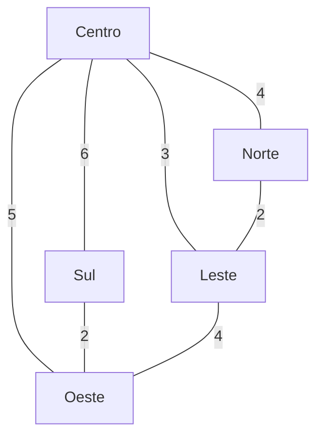

# 🚚 Otimização Inteligente de Rotas para a Sabor Express


Projeto acadêmico desenvolvido para a disciplina **Artificial Intelligence Fundamentals**.

🎓 **Curso:** Gestão da Tecnologia da Informação – UniFECAF  
👩 **Autora:** Sonia Ávila de Oliveira

---

## 📌 1. Descrição do Projeto

A **Sabor Express** é uma empresa fictícia de delivery de alimentos localizada na região central da cidade.

Durante os horários de maior demanda, como almoço e jantar, a empresa enfrenta dificuldades para definir rotas eficientes para seus entregadores. A definição manual dos percursos pode resultar em:

- atrasos nas entregas;
- percursos maiores que o necessário;
- aumento do consumo de combustível;
- utilização ineficiente dos entregadores;
- redução da satisfação dos clientes.

Diante desse cenário, este projeto propõe uma solução baseada em **algoritmos clássicos de Inteligência Artificial**, utilizando grafos, algoritmos de busca e técnicas de aprendizado não supervisionado.

A cidade é representada como um **grafo ponderado**, no qual os pontos representam localidades e as conexões representam ruas. Os pesos das conexões representam a distância estimada entre os pontos.

A solução utiliza os algoritmos **BFS, DFS e A*** para analisar o grafo e o algoritmo **K-Means** para agrupar localidades próximas em zonas de entrega.

---

# 🎯 2. Objetivos

## Objetivo Geral

Desenvolver uma solução computacional utilizando algoritmos clássicos de Inteligência Artificial para auxiliar na otimização das rotas de entrega da empresa Sabor Express.

## Objetivos Específicos

- Representar a cidade por meio de um grafo ponderado;
- Modelar localidades e conexões entre os pontos;
- Utilizar algoritmos de busca para percorrer o grafo;
- Encontrar caminhos de menor custo entre localidades;
- Comparar o comportamento dos algoritmos BFS, DFS e A*;
- Agrupar localidades próximas utilizando K-Means;
- Organizar as entregas em zonas;
- Avaliar os resultados obtidos;
- Demonstrar como técnicas de Inteligência Artificial podem apoiar decisões logísticas.

---

# 🧠 3. Abordagem da Solução

A solução foi dividida em duas etapas principais.

## 3.1 Busca de rotas

A cidade foi modelada como um grafo utilizando a biblioteca **NetworkX**.

Foram implementados três algoritmos de busca:

- **BFS (Breadth-First Search)** — busca em largura;
- **DFS (Depth-First Search)** — busca em profundidade;
- **A* (A-Star)** — busca de caminho de menor custo.

Esses algoritmos permitem observar diferentes estratégias de exploração do grafo.

O A* é utilizado para encontrar um caminho de menor custo considerando os pesos atribuídos às ruas.

## 3.2 Agrupamento das entregas

Para situações com vários pedidos, foi utilizado o algoritmo **K-Means**, pertencente à área de aprendizado não supervisionado.

As localidades possuem coordenadas fictícias e são agrupadas em **duas zonas de entrega**.

Essa estratégia permite organizar localidades próximas em grupos, facilitando o planejamento e a distribuição dos pedidos entre os entregadores.

---

# 🗺️ 4. Modelagem do Grafo

A cidade utilizada na simulação possui cinco localidades:

- Centro;
- Norte;
- Sul;
- Leste;
- Oeste.

As ruas são representadas por arestas e possuem pesos correspondentes às distâncias estimadas.

## Grafo utilizado



### Interpretação

Cada vértice representa uma localidade e cada aresta representa uma conexão entre duas localidades.

Por exemplo:

- Centro → Norte = distância 4;
- Centro → Sul = distância 6;
- Centro → Leste = distância 3;
- Centro → Oeste = distância 5;
- Norte → Leste = distância 2;
- Sul → Oeste = distância 2;
- Leste → Oeste = distância 4.

O grafo é não direcionado, considerando que as conexões podem ser percorridas nos dois sentidos.

---

# 📍 5. Dados das Entregas

As coordenadas utilizadas no agrupamento das localidades estão armazenadas no arquivo:

`data/pontos_entrega.csv`

O arquivo possui a seguinte estrutura:

```csv
local,x,y
Centro,0,0
Norte,0,3
Sul,0,-3
Leste,3,0
Oeste,-3,0
```

As coordenadas são **fictícias** e utilizadas exclusivamente para representar a posição relativa das localidades na simulação.

---

# 🤖 6. Algoritmos Utilizados

| Algoritmo | Tipo | Objetivo no projeto |
|-----------|------|---------------------|
| BFS | Busca em largura | Percorrer o grafo por níveis |
| DFS | Busca em profundidade | Explorar os caminhos em profundidade |
| A* | Busca heurística | Encontrar caminho de menor custo |
| K-Means | Aprendizado não supervisionado | Agrupar localidades em zonas |

---

## 6.1 BFS — Breadth-First Search

O **BFS** realiza a busca explorando os vértices por níveis.

No projeto, o algoritmo foi utilizado para observar a ordem de visitação das localidades a partir do ponto inicial.

### Resultado obtido

Partindo do **Centro**, a ordem de visitação observada foi:

```text
['Centro', 'Norte', 'Sul', 'Leste', 'Oeste']
```

O BFS é adequado para encontrar caminhos com menor número de arestas em grafos não ponderados. Como o problema da Sabor Express utiliza pesos representando distância, o BFS não é o algoritmo mais adequado para minimizar distância.

---

## 6.2 DFS — Depth-First Search

O **DFS** realiza a exploração seguindo um caminho em profundidade antes de retornar e explorar outras possibilidades.

### Resultado obtido

Partindo do **Centro**, a ordem de visitação observada foi:

```text
['Centro', 'Norte', 'Leste', 'Oeste', 'Sul']
```

O DFS é útil para exploração e análise da estrutura do grafo, porém não garante o caminho de menor custo em um grafo ponderado.

---

## 6.3 A* — A-Star

O algoritmo **A*** é utilizado para encontrar caminhos de menor custo entre dois pontos.

No projeto, o algoritmo considera o peso das ruas para calcular o custo da rota.

Foi realizado um teste partindo do **Centro** com destino ao **Oeste**.

### Resultado obtido

```text
Ponto de origem: Centro
Destino: Oeste
Caminho encontrado: ['Centro', 'Oeste']
Custo total: 5
```

O resultado demonstra que a conexão direta entre Centro e Oeste possui custo 5, sendo uma alternativa de menor custo para esse deslocamento.

---

## 6.4 K-Means

O **K-Means** é um algoritmo de aprendizado não supervisionado utilizado para agrupamento de dados.

Neste projeto, as coordenadas das localidades são utilizadas para formar grupos de pontos próximos.

Foi definida a criação de **2 zonas de entrega**.

### Resultado obtido

```text
K-Means - Agrupamento de Entregas
---------------------------------
Quantidade de zonas: 2

Zona 1:
['Centro', 'Norte', 'Leste']

Zona 2:
['Sul', 'Oeste']
```

A divisão permite representar uma possível estratégia de distribuição dos pedidos entre diferentes regiões de atendimento.

---

# 🔄 7. Fluxo da Solução

```text
Pontos de entrega
       │
       ▼
Representação da cidade
       │
       ▼
Construção do grafo
       │
       ├───────────────┐
       ▼               ▼
     BFS / DFS         A*
       │               │
       └───────┬───────┘
               ▼
      Análise das rotas
               │
               ▼
        Agrupamento
        com K-Means
               │
               ▼
       Zonas de entrega
               │
               ▼
       Apoio à decisão
          logística
```

---

# 📊 8. Resultados

Os testes realizados demonstraram o funcionamento dos algoritmos implementados.

## A* — Menor caminho

Para o percurso entre **Centro** e **Oeste**:

| Origem | Destino | Caminho | Custo |
|--------|---------|---------|-------|
| Centro | Oeste | Centro → Oeste | 5 |

O resultado demonstra a utilização dos pesos das arestas para determinar o custo do deslocamento.

## BFS

A partir do Centro:

```text
Centro → Norte → Sul → Leste → Oeste
```

O algoritmo realiza a exploração por níveis.

## DFS

A partir do Centro:

```text
Centro → Norte → Leste → Oeste → Sul
```

O algoritmo explora os caminhos em profundidade.

## K-Means

Com duas zonas:

```text
Zona 1:
Centro, Norte, Leste

Zona 2:
Sul, Oeste
```

O agrupamento demonstra como as localidades podem ser organizadas em regiões para auxiliar na distribuição das entregas.

---

# ⚙️ 9. Análise da Solução

Os resultados mostram que diferentes algoritmos possuem objetivos distintos.

O **BFS** é eficiente para explorar um grafo por níveis e pode encontrar caminhos com menor quantidade de conexões quando as arestas possuem o mesmo custo.

O **DFS** é útil para exploração da estrutura do grafo, mas não garante uma rota de menor custo.

O **A*** apresenta maior adequação ao problema de rotas ponderadas, pois considera os custos associados às conexões.

O **K-Means**, por sua vez, complementa a solução ao permitir a criação de grupos de localidades próximas. Dessa forma, além de encontrar caminhos, a solução também apresenta uma estratégia para organizar as entregas em zonas.

---

# ⏱️ 10. Eficiência e Complexidade

A eficiência dos algoritmos depende da quantidade de vértices e arestas existentes no grafo.

De forma geral:

| Algoritmo | Complexidade aproximada | Característica |
|-----------|--------------------------|----------------|
| BFS | O(V + E) | Exploração por níveis |
| DFS | O(V + E) | Exploração em profundidade |
| A* | Depende da heurística e do grafo | Busca direcionada ao destino |
| K-Means | O(n × k × i × d) | Agrupamento iterativo |

Onde:

- **V** = quantidade de vértices;
- **E** = quantidade de arestas;
- **n** = quantidade de pontos;
- **k** = quantidade de grupos;
- **i** = quantidade de iterações;
- **d** = número de dimensões dos dados.

Como o projeto utiliza um grafo pequeno e dados simulados, o foco principal está na demonstração dos conceitos de Inteligência Artificial e na aplicação dos algoritmos ao problema proposto.

---

# ⚠️ 11. Limitações

A solução possui algumas limitações:

- utilização de uma cidade simulada;
- quantidade reduzida de localidades;
- distâncias fictícias;
- ausência de informações de trânsito em tempo real;
- ausência de restrições como sentido das ruas;
- ausência de informações sobre capacidade dos entregadores;
- K-Means utiliza coordenadas simplificadas;
- não são considerados fatores como clima, acidentes ou congestionamentos.

Portanto, os resultados representam uma **simulação acadêmica** e não uma solução pronta para utilização em ambiente real.

---

# 🚀 12. Melhorias Futuras

Como evolução do projeto, poderiam ser implementadas:

- integração com APIs de mapas;
- utilização de dados reais de trânsito;
- atualização dinâmica das rotas;
- inclusão de ruas de sentido único;
- consideração de congestionamentos;
- inclusão de múltiplos entregadores;
- definição de capacidade máxima por entregador;
- otimização de múltiplas entregas em uma mesma rota;
- comparação de diferentes heurísticas para o A*;
- utilização de dados reais de localização;
- desenvolvimento de uma interface gráfica;
- aplicação de técnicas mais avançadas de otimização logística.

---

# 📁 13. Estrutura do Projeto

```text
Artificial-Intelligence-Fundamentals/
│
├── data/
│   └── pontos_entrega.csv
│
├── docs/
│   └── resultados.md
│
├── images/
│   └── rota_astar_centro_oeste.png
│
├── notebooks/
│
├── src/
│   ├── algorithms/
│   │   ├── __init__.py
│   │   ├── astar.py
│   │   ├── bfs.py
│   │   ├── dfs.py
│   │   └── kmeans.py
│   │
│   ├── models/
│   │   ├── __init__.py
│   │   └── city_graph.py
│   │
│   ├── utils/
│   │
│   ├── visualization/
│   │   ├── graph_visualization.py
│   │   └── route_visualization.py
│   │
│   └── __init__.py
│
├── tests/
│
├── .gitignore
├── README.md
└── requirements.txt
```

---

# 🛠️ 14. Tecnologias Utilizadas

- **Python 3.13** — linguagem utilizada no desenvolvimento;
- **NetworkX** — criação e manipulação do grafo;
- **NumPy** — operações matemáticas;
- **Scikit-Learn** — implementação do K-Means;
- **Matplotlib** — visualização dos resultados;
- **Git** — controle de versão;
- **GitHub** — hospedagem do projeto;
- **Visual Studio Code** — ambiente de desenvolvimento.

---

# ▶️ 15. Como Executar

## 15.1 Clonar o repositório

```bash
git clone https://github.com/soniaavila/Artificial-Intelligence-Fundamentals.git
```

Entrar na pasta:

```bash
cd Artificial-Intelligence-Fundamentals
```

## 15.2 Criar o ambiente virtual

```bash
python -m venv .venv
```

## 15.3 Ativar o ambiente virtual no Windows PowerShell

```powershell
.venv\Scripts\Activate.ps1
```

## 15.4 Instalar as dependências

```bash
pip install -r requirements.txt
```

## 15.5 Executar os algoritmos

### Grafo

```bash
python -m src.models.city_graph
```

### A*

```bash
python -m src.algorithms.astar
```

### BFS

```bash
python -m src.algorithms.bfs
```

### DFS

```bash
python -m src.algorithms.dfs
```

### K-Means

```bash
python -m src.algorithms.kmeans
```

Os comandos devem ser executados a partir da pasta raiz do projeto.

---

# 📷 16. Visualizações

O projeto possui uma visualização da rota encontrada pelo A*:


A imagem apresenta graficamente o percurso utilizado no teste entre Centro e Oeste.

---

# 📚 17. Referências

- Material da disciplina **Artificial Intelligence Fundamentals – UniFECAF**.
- RUSSELL, Stuart; NORVIG, Peter. *Artificial Intelligence: A Modern Approach*.
- Documentação oficial do Python.
- Documentação oficial do NetworkX.
- Documentação oficial do Scikit-Learn.
- Documentação oficial do Matplotlib.

---

# 👩‍💻 18. Autoria

**Sonia Ávila de Oliveira**

Projeto acadêmico desenvolvido para a disciplina **Artificial Intelligence Fundamentals**, do curso de **Gestão da Tecnologia da Informação – UniFECAF**.
