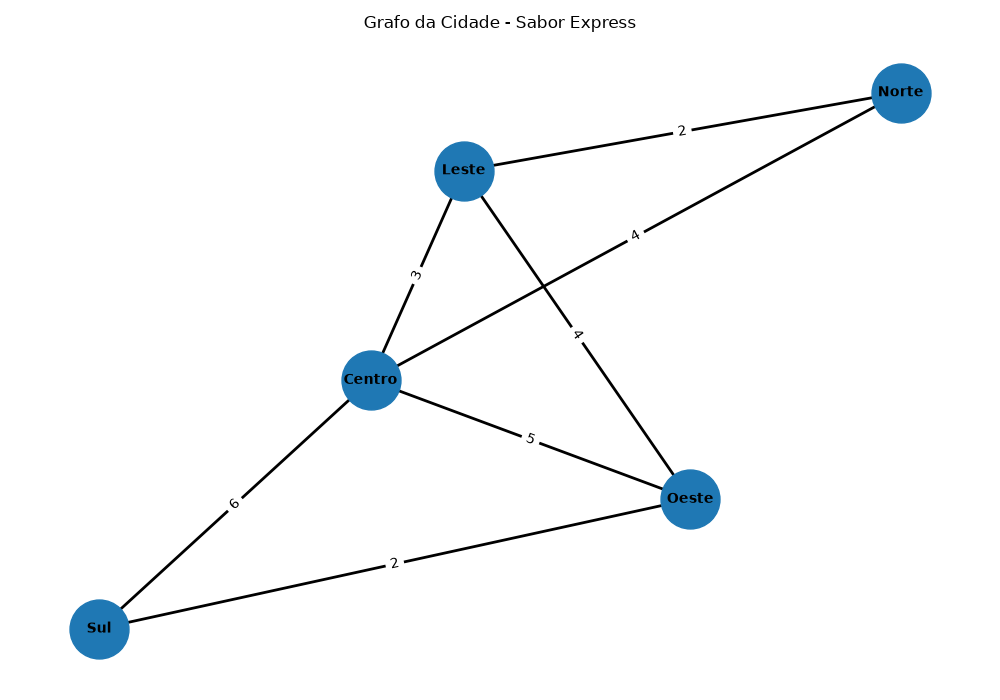
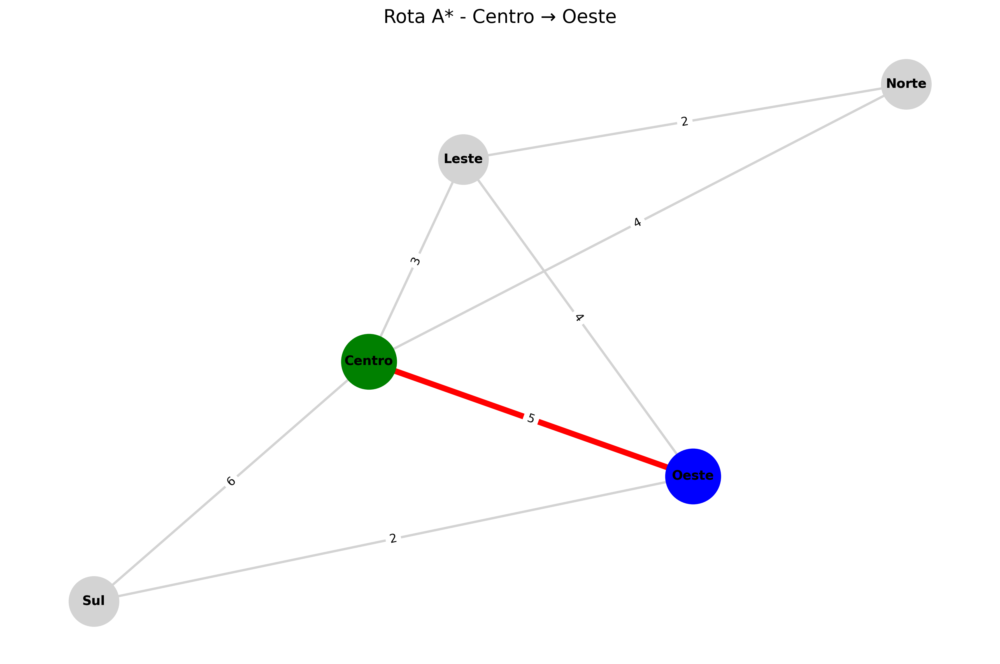

# 🚚 Otimização Inteligente de Rotas para a Sabor Express


Projeto acadêmico desenvolvido para a disciplina **Fundamentos da Inteligência Artificial**, do curso de **Gestão da Tecnologia da Informação – UniFECAF**.

**Autora:** Sonia Ávila de Oliveira

---

## 📌 1. Sobre o projeto

A **Sabor Express** é uma empresa fictícia de delivery de alimentos.

O problema escolhido para este projeto foi a organização das rotas de entrega. Em uma situação real, definir os percursos manualmente pode gerar caminhos maiores, atrasos e dificuldade para organizar vários pedidos ao mesmo tempo.

A minha proposta foi criar uma representação simples de uma cidade e utilizar algoritmos de Inteligência Artificial para analisar os caminhos disponíveis e também organizar as localidades em zonas de entrega.

Para isso, a cidade foi representada como um **grafo ponderado**. Os pontos representam localidades e as conexões representam ruas. Cada conexão possui um valor que representa uma distância estimada.

Além dos algoritmos de busca, utilizei o **K-Means** para agrupar as localidades em duas zonas de entrega.

O projeto foi desenvolvido como uma simulação acadêmica, utilizando dados fictícios.

---

## 🎯 2. Objetivos

### Objetivo geral

Desenvolver uma solução computacional utilizando algoritmos clássicos de Inteligência Artificial para auxiliar na análise e organização das rotas de entrega da empresa fictícia Sabor Express.

### Objetivos específicos

- Representar uma pequena cidade por meio de um grafo;
- Criar conexões entre as localidades;
- Associar pesos às conexões;
- Implementar busca em largura (BFS);
- Implementar busca em profundidade (DFS);
- Implementar o algoritmo A*;
- Utilizar o A* para encontrar um caminho de menor custo;
- Utilizar K-Means para agrupar localidades;
- Organizar as localidades em duas zonas;
- Criar testes automatizados;
- Analisar os resultados obtidos;
- Criar visualizações do grafo e da rota encontrada.

---

## 🧠 3. Como pensei na solução

Dividi o projeto em duas partes principais.

A primeira parte foi relacionada à **busca no grafo**.

Criei uma pequena cidade com cinco localidades e algumas conexões entre elas. Depois implementei BFS, DFS e A* para observar como cada algoritmo se comporta.

A segunda parte foi relacionada ao **agrupamento das localidades**.

Utilizei o K-Means para dividir os pontos em duas zonas. Dessa forma, além de analisar os caminhos, também foi possível representar uma possível organização das entregas por região.

Durante o desenvolvimento, procurei manter o problema pequeno para conseguir entender e testar cada algoritmo individualmente antes de juntar os resultados no programa principal.

---

## 🗺️ 4. Modelagem do grafo

A cidade utilizada na simulação possui cinco localidades:

- Centro
- Norte
- Sul
- Leste
- Oeste

As conexões representam ruas e os valores representam distâncias fictícias.

### Grafo da cidade



### Conexões utilizadas

| Origem | Destino | Distância |
|---|---|---:|
| Centro | Norte | 4 |
| Centro | Sul | 6 |
| Centro | Leste | 3 |
| Centro | Oeste | 5 |
| Norte | Leste | 2 |
| Sul | Oeste | 2 |
| Leste | Oeste | 4 |

O grafo utilizado é **não direcionado**, ou seja, as conexões podem ser percorridas nos dois sentidos.

Os valores são fictícios e foram utilizados apenas para representar o cenário proposto.

---

## 📍 5. Dados das localidades

As coordenadas utilizadas pelo K-Means estão armazenadas no arquivo:

`data/pontos_entrega.csv`

O arquivo possui a seguinte estrutura:

```csv
local,x,y
Centro,0,0
Norte,0,3
Sul,0,-3
Leste,3,0
Oeste,-3,0
```

Essas coordenadas não representam uma localização real.

Elas foram utilizadas para criar uma posição relativa entre os pontos e permitir que o K-Means realizasse o agrupamento.

---

## 🤖 6. Algoritmos utilizados

| Algoritmo | Tipo | Utilização no projeto |
|---|---|---|
| BFS | Busca em largura | Analisar a ordem de visitação |
| DFS | Busca em profundidade | Analisar a exploração do grafo |
| A* | Busca heurística | Encontrar caminho de menor custo |
| K-Means | Aprendizado não supervisionado | Agrupar localidades em zonas |

---

## 🔎 6.1 BFS — Busca em Largura

O **BFS (Breadth-First Search)** percorre o grafo por níveis.

No projeto, utilizei o **Centro** como ponto inicial para observar a ordem em que as localidades são visitadas.

### Execução

```bash
python -m src.algorithms.bfs
```

### Resultado obtido

```text
Busca em Largura (BFS)

Ponto de origem: Centro

Ordem de visitação:
['Centro', 'Norte', 'Sul', 'Leste', 'Oeste']
```

Durante o teste, foi possível perceber que o BFS visita primeiro os pontos que estão em níveis mais próximos da origem.

Uma observação importante é que o BFS trabalha com a quantidade de conexões percorridas. Como o meu grafo possui pesos representando distâncias, ele não deve ser utilizado como o algoritmo principal para determinar a menor distância.

---

## 🌳 6.2 DFS — Busca em Profundidade

O **DFS (Depth-First Search)** segue um caminho em profundidade antes de voltar para explorar outras possibilidades.

No projeto, também utilizei o **Centro** como ponto inicial.

### Execução

```bash
python -m src.algorithms.dfs
```

### Resultado obtido

```text
Busca em Profundidade (DFS)

Ponto de origem: Centro

Ordem de visitação:
['Centro', 'Norte', 'Leste', 'Oeste', 'Sul']
```

O resultado foi diferente do BFS.

Isso ajudou a visualizar na prática que duas estratégias de busca podem percorrer o mesmo grafo em ordens diferentes.

O DFS é útil para explorar a estrutura do grafo, mas não garante o caminho de menor custo em um grafo ponderado.

---

## ⭐ 6.3 A* — Busca pelo menor caminho

O **A*** foi utilizado para procurar um caminho de menor custo entre dois pontos.

Nesse algoritmo, os pesos das conexões são considerados durante a busca.

Para o teste principal, utilizei:

- **Origem:** Centro
- **Destino:** Oeste

### Execução

```bash
python -m src.algorithms.astar
```

### Resultado obtido

```text
Busca A* (A-Star)

Ponto de origem: Centro
Destino: Oeste

Caminho encontrado:
['Centro', 'Oeste']

Custo total:
5
```

Nesse caso, existe uma conexão direta entre Centro e Oeste com custo 5.

Também foi criada uma visualização da rota encontrada pelo algoritmo.

---

## 🎯 6.4 K-Means — Agrupamento das entregas

O **K-Means** é um algoritmo de aprendizado não supervisionado utilizado para dividir dados em grupos, chamados de clusters.

Neste projeto, utilizei o algoritmo para agrupar as localidades da cidade em **duas zonas de entrega**.

### Execução

```bash
python -m src.algorithms.kmeans
```

### Resultado obtido

```text
K-Means - Agrupamento de Entregas

Quantidade de zonas: 2

Zona 1:
['Centro', 'Norte', 'Leste']

Zona 2:
['Sul', 'Oeste']
```

A divisão permite representar uma possível organização das entregas por região.

A numeração das zonas não é o mais importante. O objetivo é observar quais localidades foram agrupadas.

### Aplicação no cenário

Uma possível organização seria:

**Zona 1**
- Centro
- Norte
- Leste

**Zona 2**
- Sul
- Oeste

Dessa forma, pedidos de localidades próximas poderiam ser agrupados para facilitar o planejamento das entregas.

---

## 📊 6.5 Comparação das buscas

Os algoritmos BFS, DFS e A* possuem objetivos diferentes.

| Algoritmo | Estratégia | Utilização |
|---|---|---|
| BFS | Explora por níveis | Analisar a ordem de visitação |
| DFS | Explora em profundidade | Analisar a estrutura do grafo |
| A* | Busca orientada ao destino | Encontrar caminho de menor custo |

A comparação foi importante para perceber que não existe um único algoritmo que resolva todas as partes do problema da mesma maneira.

---

## 🔄 7. Fluxo da solução

O funcionamento geral do projeto pode ser resumido da seguinte forma:

```text
Dados das localidades
        │
        ▼
Representação da cidade
        │
        ▼
Construção do grafo
        │
        ├───────────────┐
        ▼               ▼
    BFS / DFS           A*
        │               │
        └───────┬───────┘
                ▼
         Análise das rotas
                │
                ▼
          Coordenadas
                │
                ▼
             K-Means
                │
                ▼
        Zonas de entrega
                │
                ▼
      Análise dos resultados
```

---

## 📈 8. Resultados obtidos

Depois de implementar os algoritmos, realizei a execução individual e também a execução integrada pelo programa principal.

Os principais resultados foram:

### BFS

**Origem:** Centro

```text
Centro → Norte → Sul → Leste → Oeste
```

### DFS

**Origem:** Centro

```text
Centro → Norte → Leste → Oeste → Sul
```

### A*

**Origem:** Centro  
**Destino:** Oeste

```text
Centro → Oeste

Custo total: 5
```

### K-Means

**Quantidade de zonas:** 2

```text
Zona 1:
Centro, Norte, Leste

Zona 2:
Sul, Oeste
```

Os resultados mostram que cada algoritmo contribuiu de uma forma diferente para o cenário.

---

## 🧪 9. Testes automatizados

Além dos testes manuais, criei testes automatizados utilizando a biblioteca **Pytest**.

Foram criados testes para os quatro principais algoritmos:

- `tests/test_bfs.py`
- `tests/test_dfs.py`
- `tests/test_astar.py`
- `tests/test_kmeans.py`

O objetivo dos testes é verificar se os algoritmos estão retornando resultados compatíveis com o cenário utilizado no projeto.

### Execução dos testes

Com o ambiente virtual ativado:

```bash
python -m pytest
```

### Resultado da validação

Os quatro testes foram executados com sucesso:

```text
================ test session starts ================

collected 4 items

tests/test_astar.py .
tests/test_bfs.py .
tests/test_dfs.py .
tests/test_kmeans.py .

================= 4 passed =================
```

### Resultado

| Teste | Resultado |
|---|---|
| A* | ✅ PASSOU |
| BFS | ✅ PASSOU |
| DFS | ✅ PASSOU |
| K-Means | ✅ PASSOU |

O resultado **4 passed** confirma que os quatro testes automatizados passaram na execução realizada.

---

## 🖥️ 10. Execução integrada

Também foi criado um programa principal para reunir os resultados dos algoritmos em uma única execução.

### Comando

```bash
python -m src.main
```

### Resultado validado

```text
==================================================

SABOR EXPRESS
Otimização Inteligente de Rotas

==================================================

BFS - Busca em Largura

Ponto de origem: Centro

Ordem de visitação:
['Centro', 'Norte', 'Sul', 'Leste', 'Oeste']


DFS - Busca em Profundidade

Ponto de origem: Centro

Ordem de visitação:
['Centro', 'Norte', 'Leste', 'Oeste', 'Sul']


A* - Menor Caminho

Ponto de origem: Centro
Destino: Oeste

Caminho encontrado:
['Centro', 'Oeste']

Custo total:
5


K-Means - Agrupamento de Entregas

Quantidade de zonas: 2

Zona 1:
['Centro', 'Norte', 'Leste']

Zona 2:
['Sul', 'Oeste']


==================================================

Execução finalizada com sucesso!

==================================================
```

Essa execução integrada facilitou a conferência dos resultados antes de finalizar o projeto.

---

## 💭 11. O que observei durante o desenvolvimento

Uma das principais dificuldades foi entender que os algoritmos de busca possuem objetivos diferentes.

No início, a ideia de "buscar uma rota" poderia dar a impressão de que qualquer algoritmo de busca encontraria automaticamente a melhor rota. Durante a implementação, ficou mais claro para mim que isso depende da estratégia utilizada e das características do grafo.

Com o BFS, consegui observar a exploração por níveis.

Com o DFS, consegui observar uma exploração mais profunda dos caminhos.

No A*, consegui trabalhar com o custo das conexões e visualizar uma rota específica entre uma origem e um destino.

No K-Means, a lógica foi diferente, pois o algoritmo não procura uma rota. Ele trabalha com os dados das localidades para formar grupos.

Essa diferença entre os algoritmos foi uma das partes mais importantes que consegui perceber durante a realização do projeto.

---

## ⏱️ 12. Eficiência e complexidade

Como o projeto possui somente cinco localidades e sete conexões, a execução ocorre rapidamente.

Neste projeto, o objetivo principal não foi medir desempenho em grande escala, mas compreender o funcionamento dos algoritmos.

De forma geral, as complexidades aproximadas são:

| Algoritmo | Complexidade aproximada | Característica |
|---|---|---|
| BFS | O(V + E) | Exploração por níveis |
| DFS | O(V + E) | Exploração em profundidade |
| A* | Depende da heurística e do grafo | Busca direcionada |
| K-Means | O(n × k × i × d) | Agrupamento iterativo |

Onde:

- **V** = número de vértices;
- **E** = número de arestas;
- **n** = número de pontos;
- **k** = número de grupos;
- **i** = número de iterações;
- **d** = número de dimensões dos dados.

Como o cenário utilizado é pequeno, não seria adequado tirar conclusões sobre desempenho em uma cidade real somente a partir desses testes.

---

## ⚠️ 13. Limitações

O projeto possui algumas limitações porque foi desenvolvido como uma simulação acadêmica.

Entre elas:

- a cidade utilizada é fictícia;
- existem somente cinco localidades;
- as distâncias são estimadas;
- não existem dados de trânsito em tempo real;
- não são consideradas ruas de sentido único;
- não são considerados acidentes ou congestionamentos;
- não existe uma quantidade real de pedidos;
- não existe capacidade diferente entre os entregadores;
- o K-Means utiliza coordenadas simplificadas;
- não são considerados horários ou janelas de entrega.

Por causa dessas limitações, os resultados não devem ser interpretados como uma solução pronta para uma operação real de delivery.

O objetivo foi demonstrar os conceitos de Inteligência Artificial em um problema pequeno e controlado.

---

## 🚀 14. Melhorias futuras

Como evolução do projeto, poderiam ser implementadas algumas melhorias:

- integração com APIs de mapas;
- utilização de dados reais de trânsito;
- atualização dinâmica das rotas;
- inclusão de ruas de sentido único;
- consideração de congestionamentos;
- inclusão de múltiplos entregadores;
- definição de capacidade máxima por entregador;
- otimização de múltiplas entregas em uma mesma rota;
- comparação de diferentes heurísticas para o A*;
- utilização de dados reais de localização;
- inclusão de horários e janelas de entrega;
- desenvolvimento de uma interface gráfica;
- utilização de outros algoritmos de otimização.

Essas melhorias permitiriam aproximar o projeto de um cenário mais próximo de uma operação real.

---

## 📁 15. Estrutura do projeto

O projeto foi organizado em diretórios para facilitar a manutenção e a evolução do código.

```text
Artificial-Intelligence-Fundamentals/
│
├── data/
│   └── pontos_entrega.csv
│
├── docs/
│   └── resultados.md
│
├── images/
│   ├── grafo_cidade.png
│   └── rota_astar_centro_oeste.png
│
├── notebooks/
│
├── src/
│   ├── algorithms/
│   │   ├── __init__.py
│   │   ├── astar.py
│   │   ├── bfs.py
│   │   ├── dfs.py
│   │   └── kmeans.py
│   │
│   ├── models/
│   │   ├── __init__.py
│   │   └── city_graph.py
│   │
│   ├── utils/
│   │
│   ├── visualization/
│   │   ├── __init__.py
│   │   ├── graph_visualization.py
│   │   └── route_visualization.py
│   │
│   └── __init__.py
│
├── tests/
│   ├── test_astar.py
│   ├── test_bfs.py
│   ├── test_dfs.py
│   └── test_kmeans.py
│
├── .gitignore
├── README.md
└── requirements.txt
```

---

## 📂 16. Organização dos diretórios

### `src/`

Contém o código-fonte do projeto.

### `src/algorithms/`

Contém os algoritmos utilizados:

- `bfs.py` — Busca em Largura;
- `dfs.py` — Busca em Profundidade;
- `astar.py` — algoritmo A*;
- `kmeans.py` — agrupamento das localidades.

Cada algoritmo foi separado em um módulo independente.

### `src/models/`

Contém a modelagem do cenário.

O arquivo `city_graph.py` é responsável pela criação do grafo da cidade, incluindo as localidades, conexões e pesos.

### `src/visualization/`

Contém os módulos responsáveis pelas representações visuais do grafo e das rotas.

Entre eles:

- `graph_visualization.py`;
- `route_visualization.py`.

### `data/`

Contém os dados utilizados no projeto.

Atualmente é utilizado o arquivo `pontos_entrega.csv`, que contém as coordenadas fictícias das localidades.

### `docs/`

Contém a documentação complementar do projeto.

O arquivo `resultados.md` pode ser utilizado para registrar análises e resultados dos experimentos.

### `images/`

Armazena as imagens utilizadas para documentar visualmente os resultados.

### `notebooks/`

Diretório destinado a experimentos e análises exploratórias utilizando Jupyter Notebook.

### `tests/`

Diretório destinado aos testes automatizados dos componentes do projeto.

---

## 🛠️ 17. Tecnologias utilizadas

- **Python 3.13** — linguagem utilizada no desenvolvimento;
- **NetworkX** — criação e manipulação do grafo;
- **NumPy** — operações matemáticas;
- **Pandas** — leitura e organização dos dados;
- **Scikit-Learn** — utilização do K-Means;
- **Matplotlib** — geração das visualizações;
- **Pytest** — testes automatizados;
- **Git** — controle de versão;
- **GitHub** — armazenamento do projeto;
- **Visual Studio Code** — ambiente utilizado para desenvolvimento.

---

## 📦 18. Como executar o projeto

### 18.1 Clonar o repositório

```bash
git clone https://github.com/soniaavila/Artificial-Intelligence-Fundamentals.git
```

Depois entre na pasta:

```bash
cd Artificial-Intelligence-Fundamentals
```

### 18.2 Criar o ambiente virtual

No Windows:

```bash
python -m venv .venv
```

### 18.3 Ativar o ambiente virtual

No PowerShell:

```powershell
.venv\Scripts\Activate.ps1
```

### 18.4 Instalar as dependências

```bash
pip install -r requirements.txt
```

---

## ▶️ 19. Executando os algoritmos

Os módulos podem ser executados individualmente a partir da pasta raiz do projeto.

### Grafo

```bash
python -m src.models.city_graph
```

### BFS

```bash
python -m src.algorithms.bfs
```

### DFS

```bash
python -m src.algorithms.dfs
```

### A*

```bash
python -m src.algorithms.astar
```

### K-Means

```bash
python -m src.algorithms.kmeans
```

### Programa principal

Para executar todos os algoritmos em uma única execução:

```bash
python -m src.main
```

---

## 🧪 20. Executando os testes

Com o ambiente virtual ativado:

```bash
python -m pytest
```

Resultado validado durante o desenvolvimento:

```text
4 passed
```

Os quatro testes realizados foram:

| Algoritmo | Resultado |
|---|---|
| A* | ✅ PASSOU |
| BFS | ✅ PASSOU |
| DFS | ✅ PASSOU |
| K-Means | ✅ PASSOU |

---

## 🖼️ 21. Visualizações

O projeto possui visualizações para facilitar a interpretação dos resultados.

### Grafo da cidade


A imagem apresenta a representação gráfica das localidades e das conexões utilizadas no cenário.

### Rota encontrada pelo A*



A imagem apresenta graficamente a rota utilizada no teste entre Centro e Oeste.

A visualização foi importante para conferir de forma mais clara o resultado encontrado pelo algoritmo.

---

## 📊 22. Análise final

A implementação permitiu observar, na prática, como diferentes técnicas podem ser utilizadas em partes diferentes de um mesmo problema.

O BFS e o DFS foram importantes para entender as estratégias de exploração do grafo.

O A* apresentou uma aplicação mais direta ao problema de rota, pois considera os custos das conexões durante a busca.

O K-Means teve uma função diferente. Em vez de encontrar caminhos, foi utilizado para separar as localidades em grupos.

Os testes automatizados também ajudaram a verificar se os quatro módulos principais estavam retornando os resultados esperados para o cenário criado.

---

## 🎓 23. Conclusão

O desenvolvimento deste projeto permitiu colocar em prática alguns dos conceitos estudados na disciplina de Fundamentos da Inteligência Artificial.

A modelagem em grafo ajudou a representar uma pequena cidade e suas conexões.

O BFS e o DFS permitiram observar diferentes formas de explorar o mesmo grafo.

O A* foi utilizado para trabalhar com uma rota considerando o custo das conexões. No exemplo testado, o caminho entre Centro e Oeste apresentou custo total 5.

O K-Means foi utilizado de uma maneira diferente, agrupando as localidades em duas zonas de entrega.

Também foram criados testes automatizados para os quatro algoritmos principais, e os quatro testes passaram na validação realizada.

Apesar de ser uma simulação pequena e utilizar dados fictícios, o projeto ajudou a entender como diferentes técnicas podem ser combinadas para analisar um problema relacionado à logística.

Uma evolução natural seria utilizar dados reais, mapas, trânsito e vários pedidos e entregadores. Isso permitiria transformar o exemplo acadêmico em uma solução mais próxima de um problema real de otimização logística.

---

## 📚 24. Referências

- Material da disciplina **Fundamentos da Inteligência Artificial – UniFECAF**.
- RUSSELL, Stuart; NORVIG, Peter. *Artificial Intelligence: A Modern Approach*.
- Documentação oficial do Python.
- Documentação oficial do NetworkX.
- Documentação oficial do Scikit-Learn.
- Documentação oficial do NumPy.
- Documentação oficial do Pandas.
- Documentação oficial do Matplotlib.
- Documentação oficial do Pytest.

---

## 👩‍💻 Autoria

**Sonia Ávila de Oliveira**

Gestão da Tecnologia da Informação – UniFECAF

Projeto acadêmico desenvolvido para a disciplina **Fundamentos da Inteligência Artificial**.
