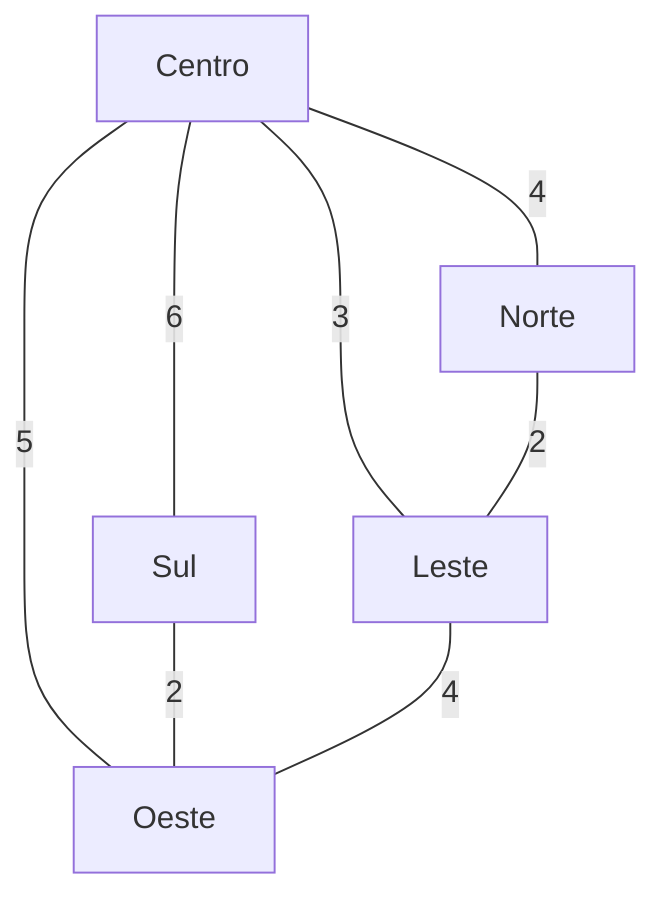

# 🚚 Otimização Inteligente de Rotas para a Sabor Express


Projeto acadêmico desenvolvido para a disciplina **Fundamentos da Inteligência Artificial**.

🎓 **Curso:** Gestão da Tecnologia da Informação – UniFECAF  
👩 **Autora:** Sonia Ávila de Oliveira

---

## 📌 Descrição do Projeto

A **Sabor Express** é uma empresa fictícia de delivery de alimentos localizada na região central da cidade.

Durante os horários de maior demanda, como almoço e jantar, a empresa enfrenta dificuldades para definir rotas eficientes para seus entregadores. A definição manual dos percursos pode resultar em:

- atrasos nas entregas;
- percursos maiores que o necessário;
- aumento do consumo de combustível;
- utilização ineficiente dos entregadores;
- redução da satisfação dos clientes.

Diante desse cenário, este projeto propõe uma solução baseada em **algoritmos clássicos de Inteligência Artificial**, utilizando grafos e técnicas de aprendizado não supervisionado.

A cidade é representada como um **grafo ponderado**, no qual os pontos representam localidades e as conexões representam ruas. Os pesos das conexões representam a distância estimada entre os pontos.

A solução utiliza algoritmos de busca para analisar os caminhos disponíveis e o algoritmo **K-Means** para agrupar localidades próximas em zonas de entrega.

---

# 🎯 Objetivos

## Objetivo Geral

Desenvolver uma solução computacional utilizando algoritmos clássicos de Inteligência Artificial para auxiliar na otimização das rotas de entrega da empresa Sabor Express.

## Objetivos Específicos

- Representar a cidade por meio de um grafo ponderado;
- Modelar localidades e conexões entre os pontos;
- Utilizar algoritmos de busca para percorrer o grafo;
- Encontrar caminhos de menor custo entre localidades;
- Comparar o comportamento dos algoritmos BFS, DFS e A*;
- Agrupar localidades próximas utilizando K-Means;
- Organizar as entregas em zonas;
- Avaliar os resultados obtidos;
- Demonstrar como técnicas de Inteligência Artificial podem apoiar decisões logísticas.

---

# 🧠 Abordagem da Solução

A solução foi dividida em duas etapas principais.

### 1. Busca de rotas

A cidade foi modelada como um grafo utilizando a biblioteca **NetworkX**.

Foram implementados três algoritmos de busca:

- **BFS (Breadth-First Search)**;
- **DFS (Depth-First Search)**;
- **A* (A-Star)**.

Os algoritmos permitem analisar diferentes formas de percorrer o grafo e encontrar caminhos entre os pontos da cidade.

### 2. Agrupamento das entregas

Para situações com vários pedidos, foi utilizado o algoritmo **K-Means**, pertencente à área de aprendizado não supervisionado.

As localidades possuem coordenadas fictícias e são agrupadas em duas zonas.

Essa estratégia permite simular uma divisão das entregas por regiões, facilitando a organização dos pedidos entre os entregadores.

---

# 🗺️ Modelagem do Grafo

A cidade utilizada na simulação possui cinco localidades:

- Centro;
- Norte;
- Sul;
- Leste;
- Oeste.

As ruas são representadas por arestas e possuem pesos correspondentes às distâncias estimadas.

## Grafo utilizado



### Representação das conexões

| Origem | Destino | Distância |
|---|---|---:|
| Centro | Norte | 4 |
| Centro | Sul | 6 |
| Centro | Leste | 3 |
| Centro | Oeste | 5 |
| Norte | Leste | 2 |
| Sul | Oeste | 2 |
| Leste | Oeste | 4 |

Os valores utilizados são fictícios e têm como objetivo representar uma pequena malha urbana para fins acadêmicos.

---

# 📍 Dados das Localidades

As coordenadas utilizadas para o agrupamento com K-Means estão armazenadas no arquivo:

`data/pontos_entrega.csv`

O arquivo possui a seguinte estrutura:

```csv
local,x,y
Centro,0,0
Norte,0,3
Sul,0,-3
Leste,3,0
Oeste,-3,0
```

As coordenadas representam posições fictícias das localidades no cenário da Sabor Express.

---

# 🤖 Algoritmos Utilizados

| Algoritmo | Objetivo |
|---|---|
| **BFS** | Percorrer o grafo em largura |
| **DFS** | Percorrer o grafo em profundidade |
| **A\*** | Encontrar um caminho de menor custo |
| **K-Means** | Agrupar localidades próximas |

---

# 🔎 BFS — Busca em Largura

O algoritmo **BFS (Breadth-First Search)** percorre o grafo explorando primeiro os pontos mais próximos da origem.

No projeto, a busca é utilizada para analisar a ordem de visitação das localidades a partir do ponto inicial.

### Exemplo

Origem:

**Centro**

Resultado obtido:

```text
['Centro', 'Norte', 'Sul', 'Leste', 'Oeste']
```

O BFS é útil para analisar a estrutura de conectividade do grafo e a ordem em que os pontos são alcançados.

---

# 🌳 DFS — Busca em Profundidade

O algoritmo **DFS (Depth-First Search)** explora um caminho em profundidade antes de retornar para explorar outras conexões.

No projeto, a busca parte do **Centro**.

### Resultado obtido

```text
['Centro', 'Norte', 'Leste', 'Oeste', 'Sul']
```

O resultado demonstra que a ordem de visitação do DFS é diferente da obtida pelo BFS.

Isso permite observar, de forma prática, que diferentes estratégias de busca podem produzir diferentes ordens de exploração do mesmo grafo.

---

# ⭐ A* — A-Star

O algoritmo **A\*** é utilizado para encontrar caminhos de menor custo entre dois pontos.

No projeto, as distâncias das ruas são utilizadas como pesos das conexões.

### Exemplo utilizado

**Origem:** Centro  
**Destino:** Oeste

Resultado:

```text
Caminho encontrado:
['Centro', 'Oeste']

Custo total:
5
```

A conexão direta entre Centro e Oeste possui custo 5.

O algoritmo A* utiliza informações do caminho para direcionar a busca em direção ao destino.

---

# 📊 Comparação das Buscas

Os algoritmos BFS, DFS e A* possuem objetivos e comportamentos diferentes.

| Algoritmo | Estratégia | Utilização no projeto |
|---|---|---|
| BFS | Explora por níveis | Análise da ordem de visitação |
| DFS | Explora em profundidade | Análise da ordem de visitação |
| A* | Busca orientada ao destino | Encontrar caminho de menor custo |

A comparação demonstra que algoritmos diferentes podem ser utilizados para finalidades diferentes dentro de um mesmo problema.

---

# 🎯 K-Means — Agrupamento de Entregas

O **K-Means** é um algoritmo de aprendizado de máquina não supervisionado utilizado para dividir dados em grupos, chamados de clusters.

Neste projeto, o algoritmo é utilizado para agrupar as localidades da cidade em **duas zonas de entrega**.

Foi utilizado:

```text
Número de zonas: 2
```

As coordenadas dos pontos são utilizadas como entrada do algoritmo.

### Resultado obtido

Uma das execuções apresentou:

```text
Zona 1:
['Centro', 'Norte', 'Leste']

Zona 2:
['Sul', 'Oeste']
```

O resultado pode variar na identificação numérica das zonas, pois o K-Means trabalha com clusters. O importante é a formação dos grupos de localidades próximas.

### Aplicação prática

Essa divisão pode auxiliar a Sabor Express na organização das entregas.

Por exemplo:

```text
Zona 1
Centro
Norte
Leste

Zona 2
Sul
Oeste
```

Dessa forma, pedidos de regiões próximas podem ser agrupados para facilitar o planejamento das entregas.

---

# 🔄 Fluxo da Solução

```text
Dados das localidades
        │
        ▼
Construção do grafo
        │
        ▼
┌───────────────────────┐
│ Algoritmos de busca   │
│                       │
│ BFS                   │
│ DFS                   │
│ A*                    │
└───────────────────────┘
        │
        ▼
Análise das rotas
        │
        ▼
Coordenadas das entregas
        │
        ▼
K-Means
        │
        ▼
Agrupamento em zonas
        │
        ▼
Resultados e visualizações
```

---

# 🖥️ Estrutura do Projeto

O projeto foi organizado em diretórios para facilitar a manutenção e a evolução do código.

```text
Artificial-Intelligence-Fundamentals/
│
├── data/
│   └── pontos_entrega.csv
│
├── docs/
│   └── resultados.md
│
├── images/
│   └── rota_astar_centro_oeste.png
│
├── notebooks/
│
├── src/
│   ├── algorithms/
│   │   ├── __init__.py
│   │   ├── astar.py
│   │   ├── bfs.py
│   │   ├── dfs.py
│   │   └── kmeans.py
│   │
│   ├── models/
│   │   ├── __init__.py
│   │   └── city_graph.py
│   │
│   └── visualization/
│       ├── __init__.py
│       ├── graph_visualization.py
│       └── route_visualization.py
│
├── tests/
│
├── .gitignore
├── README.md
└── requirements.txt
```

---

# 📂 Organização dos Diretórios

## `src/`

Contém o código-fonte da aplicação.

---

## `src/algorithms/`

Contém os algoritmos de Inteligência Artificial utilizados no projeto:

- `bfs.py` — Busca em Largura;
- `dfs.py` — Busca em Profundidade;
- `astar.py` — algoritmo A*;
- `kmeans.py` — agrupamento das localidades.

Cada algoritmo foi separado em um módulo independente.

---

## `src/models/`

Contém a modelagem do cenário.

O arquivo `city_graph.py` é responsável pela criação do grafo da cidade, incluindo:

- localidades;
- conexões;
- pesos das conexões.

---

## `src/visualization/`

Contém os módulos responsáveis pela representação visual dos resultados.

Entre eles:

- `graph_visualization.py`;
- `route_visualization.py`.

Esses módulos permitem representar graficamente o grafo e as rotas encontradas.

---

## `data/`

Contém os dados utilizados no projeto.

Atualmente é utilizado o arquivo:

```text
pontos_entrega.csv
```

que contém as coordenadas fictícias das localidades.

---

## `docs/`

Contém a documentação complementar do projeto.

O arquivo `resultados.md` será utilizado para registrar análises e resultados dos experimentos.

---

## `images/`

Armazena imagens utilizadas para documentar visualmente os resultados.

---

## `notebooks/`

Diretório destinado a experimentos e análises exploratórias utilizando Jupyter Notebook.

---

## `tests/`

Diretório destinado aos testes automatizados dos componentes do projeto.

---

# 🛠️ Ferramentas e Tecnologias

- **Python 3.13** — linguagem utilizada no desenvolvimento;
- **NetworkX** — criação e manipulação dos grafos;
- **NumPy** — operações matemáticas e dados numéricos;
- **Pandas** — leitura e tratamento de dados;
- **Matplotlib** — geração de gráficos e visualizações;
- **Scikit-Learn** — implementação do algoritmo K-Means;
- **Visual Studio Code** — ambiente de desenvolvimento;
- **Git** — controle de versão;
- **GitHub** — hospedagem do código-fonte.

---

# 📦 Instalação

## 1. Clonar o repositório

```bash
git clone https://github.com/soniaavila/Artificial-Intelligence-Fundamentals.git
```

Entrar na pasta:

```bash
cd Artificial-Intelligence-Fundamentals
```

---

## 2. Criar o ambiente virtual

No Windows:

```bash
python -m venv .venv
```

Ativar:

```powershell
.venv\Scripts\Activate.ps1
```

---

## 3. Instalar as dependências

```bash
pip install -r requirements.txt
```

As principais bibliotecas utilizadas são:

```text
networkx
numpy
pandas
matplotlib
scikit-learn
```

---

# ▶️ Execução

Como o projeto utiliza a estrutura `src`, os módulos devem ser executados a partir da raiz do projeto utilizando `python -m`.

### Grafo da cidade

```bash
python -m src.models.city_graph
```

### BFS

```bash
python -m src.algorithms.bfs
```

### DFS

```bash
python -m src.algorithms.dfs
```

### A*

```bash
python -m src.algorithms.astar
```

### K-Means

```bash
python -m src.algorithms.kmeans
```

---

# 📈 Resultados

Os resultados obtidos durante os testes demonstram o funcionamento dos algoritmos implementados.

### A*

Para a rota entre **Centro** e **Oeste**:

```text
Origem: Centro
Destino: Oeste

Caminho:
Centro → Oeste

Custo total:
5
```

### BFS

```text
Origem: Centro

Ordem de visitação:
Centro
Norte
Sul
Leste
Oeste
```

### DFS

```text
Origem: Centro

Ordem de visitação:
Centro
Norte
Leste
Oeste
Sul
```

### K-Means

```text
Quantidade de zonas: 2

Zona 1:
Centro
Norte
Leste

Zona 2:
Sul
Oeste
```

Os resultados detalhados e as análises dos experimentos serão registrados no arquivo:

`docs/resultados.md`

---

# 🖼️ Visualização

O projeto também possui módulos destinados à visualização gráfica do grafo e das rotas.

Uma das visualizações representa a rota encontrada pelo algoritmo A* entre:

```text
Centro → Oeste
```

A imagem correspondente está armazenada em:

```text
images/rota_astar_centro_oeste.png
```

---

# ⚠️ Limitações

O projeto possui algumas limitações decorrentes da utilização de dados simulados.

Entre elas:

- utilização de localidades fictícias;
- utilização de distâncias estimadas;
- ausência de dados de trânsito em tempo real;
- ausência de condições climáticas;
- ausência de informações sobre quantidade real de pedidos;
- modelo simplificado da malha urbana;
- utilização de coordenadas fictícias para o K-Means.

Portanto, os resultados representam uma **simulação acadêmica** e não uma solução de logística pronta para produção.

---

# 🚀 Melhorias Futuras

Como possíveis evoluções do projeto, podem ser implementadas:

- integração com APIs de mapas;
- utilização de dados reais de trânsito;
- atualização dinâmica das rotas;
- inclusão de horários e janelas de entrega;
- consideração da quantidade de pedidos;
- comparação de diferentes heurísticas para o A*;
- utilização de dados reais de localização;
- desenvolvimento de uma interface gráfica;
- implementação de novos algoritmos de otimização;
- utilização de técnicas de aprendizado de máquina mais avançadas.

---

# 🎓 Conclusão

O projeto demonstra, de forma prática, como conceitos de **Inteligência Artificial** podem ser aplicados a um problema de logística.

A utilização de grafos permitiu representar a estrutura da cidade e suas conexões.

Os algoritmos **BFS e DFS** possibilitaram analisar diferentes estratégias de exploração do grafo, enquanto o **A\*** foi utilizado para encontrar um caminho de menor custo entre dois pontos.

Já o **K-Means** permitiu agrupar localidades próximas em zonas de entrega, demonstrando uma aplicação de aprendizado não supervisionado na organização logística.

Apesar das simplificações e do uso de dados fictícios, o projeto apresenta uma base para compreender como algoritmos de Inteligência Artificial podem auxiliar na tomada de decisões relacionadas à distribuição e entrega de pedidos.

---

# 📚 Referências

- Material da disciplina **Fundamentos da Inteligência Artificial – UniFECAF**.
- RUSSELL, Stuart; NORVIG, Peter. *Artificial Intelligence: A Modern Approach*.
- Documentação oficial do Python.
- Documentação oficial do NetworkX.
- Documentação oficial do Scikit-Learn.
- Documentação oficial do NumPy.
- Documentação oficial do Pandas.
- Documentação oficial do Matplotlib.

---

# 👩‍💻 Autora

**Sonia Ávila de Oliveira**

Gestão da Tecnologia da Informação – UniFECAF

Projeto acadêmico desenvolvido para a disciplina **Fundamentos da Inteligência Artificial**.

---

Gestão da Tecnologia da Informação – UniFECAF

Projeto acadêmico desenvolvido para a disciplina **Fundamentos da Inteligência Artificial**.

---
